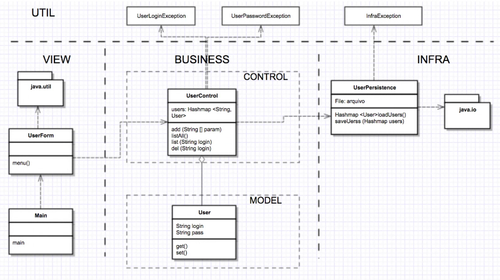
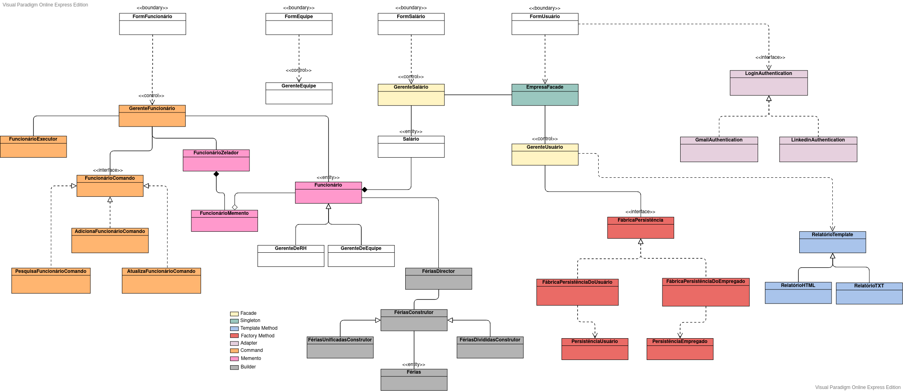

# Paperfly

### How to compile?

```sh
# In paperfly root/folder:

# Linux
~$ find -name "*.java" > sources.txt && javac -d bin @sources.txt
```

### How to run?

```sh
# In paperfly root/folder:
~$ cd ./bin && java view.Main
```

### development environment

- Visual Studio Code

##### Extensions:

- vscjava.vscode-java-debug
- youmaycallmev.vscode-java-saber
- redhat.java

### UML



### Patterns Used (Padrões de Projeto)

Quantidade de padrões: 8

|      Padrão      |                                Onde foi utilizado                                 |
| :--------------: | :-------------------------------------------------------------------------------: |
|      Facade      |                       Abstrai as funcionalidades do sistema                       |
|    Singleton     |                Obter apenas uma instância da classe CompanyFacade                 |
|     Adapter      |             Autenticação em plataformas externas (Google e Linkedin)              |
| Template Methods |                        Geração de relatórios (TXT e HTML)                         |
|     Builder      |                          Utilizado nos Models de Férias                           |
|     Command      |                     Atualizar, buscar e adicionar empregados                      |
|     Memento      | Armazenar o estado de um empregado, possibilitando desfazer uma atualização feita |
|     Strategy     |       Estratégia que define os bônus no salário, baseado no banco de horas        |

### Diagrama de Classes


